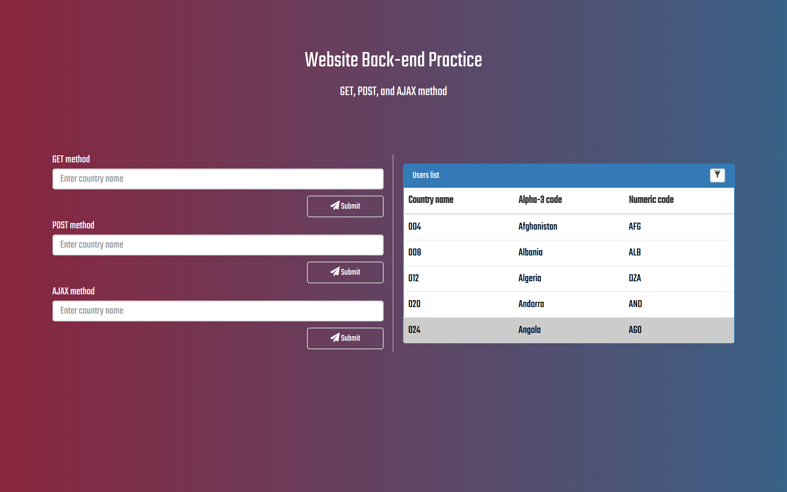

# Website Backend Practice

This practice is a simple implementation to the basic back-end techniques, including `GET`, `POST`, and AJAX methods.

## Introduction

This repository is a simple implementation to `GET`, `POST`, and AJAX methods. This practice contain client and server code, you can compare the different among above. The demo is in the following link.

## [Demo](#)

## Description

* `index.html`
* `./js` - contain all `.js` file
    * `get.js` - implememt `GET` method
    * `post.js` - implement `POST` method
    * `ajax.js` - implement `AJAX` method
    * `search.js` - return result
    * `filter.js` - filter the data according to the user input
* `./data` - contain a simple data as example
    * `country.json` - example data for this practice

## TODO

(Update soon.)

## Author

* [Yung-Sheng Lu](https://github.com/yungshenglu)

---

